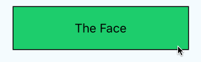

react-native-flip-card
===

> The card component which have motion of flip for React Native

[](https://nodei.co/npm/react-native-flip-card/)

[]()[]()

[](https://github.com/feross/standard)

Demo
---



Installation
==

in Cli
---
```
npm i react-native-flip-card
```

in JavaScirpt
---
```
import FlipCard, {
  Face,
  Back
} from './index.js'
```


Usage
===

Simple
---
```
<FlipCard >
  <Face>
    <Text>The Face</Text>
  </Face>
  <Back>
    <Text>The Back</Text>
  </Back>
</FlipCard>
```

Customized
---
```
<FlipCard 
  style={styles.card}
  flipped={false}
  clickable={true}
  onFlipped={(isFlipped)=>{console.log('isFlipped', isFlipped)}}
>
  <Face>
    <Text>The Face</Text>
  </Face>
  <Back>
    <Text>The Back</Text>
  </Back>
</FlipCard>

```

Props
===

flipped(boolean) `Default: false`
---
If you change default display side, you can set `true` to this param.

clicakble(boolean) `Default: true`
---
If you want disable click a card, you can set `false` to this param.

onFlipped(function) `(is_flipped) => {}`
---
When a card finish a flip animation, call `onFlipped` function with param.


Credits
===
Inspired by [react-flipcard](https://github.com/mzabriskie/react-flipcard)


License
===
MIT

j